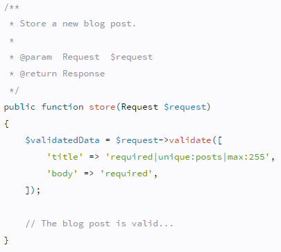
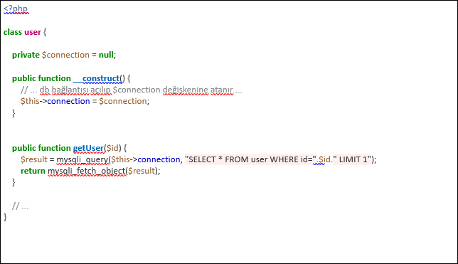
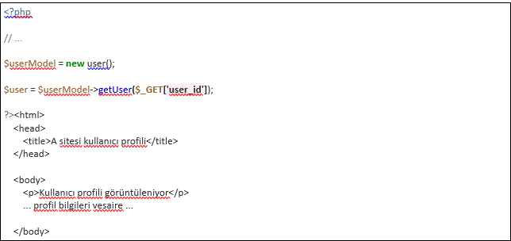
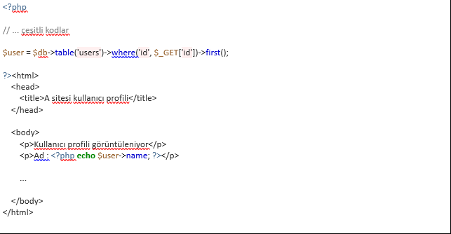

# 💫 Daily-notes
Gün içinde Development yaparken öğrendiğim her şeyi buraya yazmaya karar verdim. Bu şey de olabilir; karşılaştığım hataların çözüm yollarıda olabilir. Ona şimdi emin olamadım.😀
#### O zaman başlayalım 🚀

### WEB SERVİS MİMARİLERİ
Veri akışının platform bağımsız gerçekleşebilmesi için bir web servis mimarisine ihtiyaç duyulmaktadır. Bu veri akışının HTTP üzerinden sağlanması Remote Procedure Call olarak isimlendirilir.

2 çeşit web servis mimarisi mevcuttur.

### 1- REST WEB SERVİS MİMARİSİ

JSON,XML,TXT,HTML gibi veri tiplerinin gönderilmesini destekleyen web servis mimarilerini REST mimariler denir.En kullanışlı web servis mimarisidir.

Rest Web servis mimarisi literatürüne uygun yazılan web servis mimarilerine RESTful web servis olarak adlandırılır.

### 2- SOAP WEB SERVİS MİMARİSİ

Sadece XML veri tiplerini destekleyen yapıya SAOP web servis mimarileri denir.

#### RESTFUL WEB SERVİS MİMARİSİ

##### ✔️ A.) Get Metodu:
Get metodu kullanıldığında istekler URL kısmından gönderilir.Gönderilen bilgiler URL' de görüntüleneceği için güvenlik riski yüksek bir metottur.

##### ✔️ B.) Post Metodu:
POST metodunda da istekler URL kısmından gönderilir.Ancak GET metoduna göre hızlı ve daha güvenilirdir.

##### ✔️ C.) Put Metodu:
PUT metodunu bir formdaki verinin tamamını göndermek gerektiği durumda kullanırız.

##### ✔️ D.) Patch Metodu:
Patch metodunu ise bir formda client sadece email' ini güncellemek isterse bu durumda patch kullanılmalıdır.
Patch gereken ksımda PUT metodu kullanılmalıdır ki RESTful mimarisine bağlı kalmış olalım.

##### ✔️ E.) Delete Metodu:
DELETE metodu URL de belirlediğimiz resource'un tamamı ile silinmesi için kullanılan bir metottur.

### Authentication ve Authorization (Kimlik doğrulama ve Yetkilendirme)

Authentication,bir kullanıcının herhangi bir kaynağa erişimde kimliğinin doğrulanması işlemidir.

Kullanıcıya Kimsin sorusu sorulur? Bu sorunun cevabı genellikle kullanıcının kullanıcı  adı ve  şifre şeklinde cevap vermesiyle yanıtlanır.

        - Authentication = login + password (who you are)

Güvenliğin daha yüksek tutulması gereken durumlarda kullanıcı adı ve şifre ile beraber dijital sertifikalar kullanılarak güvenliğin arttırılması sağlanabilir.

Authentication,authorization'dan önce gelmektedir.

Authorization ise,kimliği doğrulanan kullanıcının erişmek istediği kaynak üzerindeki yetkilerini tanımlar.

Dosya-klasör erişimleri,erişim saatleri,ayrılmış alan miktarı v.b.

Authorization işleminin iki aşaması mevcuttur.

- 1) Sistem yöneticisi erişilecek kaynak üzerinde izinleri tanımlar

- 2) Erişilecek kaynağın üzerinde bulunduğu sistem veya uygulama kaynağa erişileceği zaman izinleri doğrular.

          - Authorization = permissions (what you are allowed to do)

Peki authentication işlemi yapılmadan authorization işlemi yapılamaz mı?

Kimsin sorusunun sorulmaması demek herhangi birisi anlamına gelir. Dolayısı ile kimliği doğrulanmayan yani anonim kullanıcılara izin verileceği durumlarda bu işlem gerçekleştirilir.

### Php (Laravel) Notlar
### 1. Cross Site Request Forgery (CSRF)
### 1.a CSRF Nedir ?

Türkçe açılımı “Siteler Arası İstek Sahtekârlığı” şeklinde olan CSRF zafiyeti; web uygulamasını kullanmakta olan kullanıcıların istekleri dışında işlemler yürütülmesidir. Uygulamaya giden isteklerin hangi kaynaktan ve nasıl gönderildiği kontrol edilmeyen sistemlerde ortaya çıkan bu zafiyet, aslında uygulamayı kodlayan yazılımcıların gözünden kaçan bir ayrıntıdır diyebiliriz. Genelde CSRF veya XSRF şeklinde kısaltılan bu güvenlik açığı “Session Riding” olarak da bilinmektedir.

### 1.b CSRF ile ne gibi zararlar verilebilir ?

Bu güvenlik açığı ile verilebilecek zararlar uygulamayı kullanmakta olan kullanıcının yetkilerine bağlıdır. Yani bir sistem yöneticisinin hesabı ile standart kullanıcının hesapları üzerinden uygulanacak bir CSRF açığının vereceği zararın boyutları farklıdır. Bir örnek ile açıklamak gerekirse; Banka hesabını incelemekte olan birisinin aynı zamanda yan sekmede maillerini kontrol ettiğini düşünelim. Hedef kişi, saldırgan tarafından gönderilen zararlı bir bağlantıya tıkladığı zaman, hedef kullanıcı mail sekmesinde olmasına rağmen saldırgan, hedefin yan sekmesinde açık bulunan banka sayfasına ve verilerine erişebilir. Çünkü hedefin banka sayfasındaki oturumu halen aktif olduğu için saldırganın ihtiyacı olan bilgiler tarayıcıda halen mevcut durumdadır. Hedef kullanıcı oturumunu sonlandırmadığı sürece saldırgan kişi “para transferi, kredi çekme” gibi ciddi zararlara yol açabilecek işlemleri arka planda gizlice gerçekleştirebilir.

### 1.c Zafiyetli Kod & Güvenli Kod

Şu anda banka sisteminin POST methodunu kullandığını ve savunmasız talebin şuna benzediğini varsayalım:

        http://bankasitesi.com/transfer.do hedef_bankahesabı=MUSTAFA ve miktarı = 100

Böyle bir istek az önceki gibi standart A veya IMG etiketleri kullanılarak teslim edilemez, ancak bir FORM etiketi kullanılarak teslim edilebilir:

        <form action = “<nowiki> http://bankasitesi.com/transfer.do </nowiki>” method = “POST”>
              <input type = “hidden” name = “acct” value = “MUSTAFA” />
                <input type = “hidden” name = “amount” value = “100000” />
                <input type = “submit” value = “İndirimleri görüntüle” /> 
        </ Form>

Bu form, kullanıcının gönder düğmesine basmasını gerektirecektir, ancak bu, JavaScript kullanılarak otomatik olarak da çalıştırılabilir:

        <body onload = “document.forms [0] .submit ()”>
        <Form …

şeklinde bir dizi kod ile formun otomatik olarak gönderilmesi sağlanabilir.
Bu senaryonun önüne geçmek için isteklere, kullanılan formlara token bilgisi eklenilmelidir. Aynı senaryoyu token bilgisi ile çalışan bir sistemde tekrarlayalım:

        <form action = “<nowiki> http://bankasitesi.com/transfer.do&token=314asdq62643383279!%5028841971 </nowiki>” method = “POST”>

Bir önceki örnekten farklı olarak bu sefer gönderdiğimiz isteğe bir de anlık olarak ürettiğimiz benzersiz token bilgisini ekledik. Saldırgan bu tokeni tahmin edemeyeceği için bu güvenlik açığı üzerinden hedef kişiye saldıramaz.

### 1.d CSRF Zafiyeti Nasıl Tespit Edilir?

Kullanıcı tarafından gönderilen bir HTTP talebinin gerçek kullanıcı tarafından mı yoksa bir saldırgan tarafından mı gönderildiğini tespit etmek zordur. Web sitesine erişmeye çalışan bir kullanıcının kimliğini doğrulamak için sıkı önlemler alınabilir, fakat kullanıcılar aynı oturumda tekrar tekrar kimlik doğrulamak ile uğraşmak istemezler. Sistemde token yönteminin kullanılması, kimliğin arka planda otomatik olarak doğrulanmasını sağlar. Böylece kullanıcı kimlik doğrulama istekleriyle sürekli olarak rahatsız edilmez. Genelde CSRF açığını engellemek için sisteme giriş yapan kullanıcıya, her defasında farklı ve tahmin edilmesi güç “token” bilgisi verilir. Fakat bu token verisi oturum boyunca aynı kalmaz. Örneğin kullanıcının yüklediği her bir form için ayrı token bilgisi üretilir. Arkaplanda gerçekleşen bu olayda, sisteme giriş yapan kullanıcı token aldığını her ne kadar fark etmese de, yaptığı tüm işlemlerde bu token sistem tarafından kontrol edilir ve işlemin gerçekten kullanıcı tarafından yapıldığı doğrulanır. Eğer token veya buna benzer bir anahtar kontrolü yapılmazsa, arka planda gönderilen sahte bir istek ile gerçek kullanıcının gönderdiği istek ayırt edilemez. Bu durumda sistemin gelen tüm istekleri ayırt etmeksizin kabul etmesi gerekir ki bu büyük bir güvenlik zafiyetine sebep olur.

### 1.e CSRF Zafiyetine Karşı Alınabilecek Önlemler

✔️ Kullanıcının sisteme gönderdiği önemli talepler POST metodu ile alınmalıdır.

✔️ Siteler Arası Talep Sahteciliğini (CSRF) önlemek için en popüler yöntem, kullanıcıya rastgele üretilmiş eşsiz bir “token” bilgisi vermektir. CSRF Token veya Synchronizer Token olarak adlandırılan bu yöntem şu şekilde çalışır:
        - Web sunucusu bir token oluşturur. (Bu token işlem yapıldıkça yeniden üretilir.)
        - Token, formda gizli bir bilgi olarak depolanır.
        - Kullanıcı POST işlemini gerçekleştirir.
        - Token bilgisi POST verilerine dahil edilir.
        - Web uygulaması, sistem tarafından oluşturulan tokeni, talepte gönderilen token ile karşılaştırır.
        - Eğer token verileri eşleşirse, isteğin gerçek kullanıcı tarafından gönderildiği anlaşılır ve istek onaylanır.
        - Eşleşme yoksa, istek reddedilir. Bu sayede kötü niyetli istekler engellenmiş olur.

### 1.f CSRF açığının laravel'de kapatılması

Uygulamamızda kullanacağımız formları csrf alanı olarak belirlemeliyiz.

                <form method="POST" action="/profile">
                        @csrf
                        ...
                </form>

### 2. Laravel Regex Validation Kullanımı

Geliştirdiğimiz uygulamada 1/0 işleminin yapıldığını düşünelim.Yada boş bir input' un database kaydedildiği, email gerektiren input'a isim yada sayı girildiğide olabilir.Gerekli kontroller yapılmazsa ne olur ? İşte bu noktada işin içine Regex,Validation giriyor.Kullanımı laravel de oldukça basit ve gerekli formlarda kesinlikle kullanılmalıdır.

✔️ Laravel de validation kullanımı

Aşağıda ki store fonksiyonumuzda gelen request deki formda title,body inputunun girilmesi gerektiği ve title' ın max 255 karakter olduğu belirtilmiştir.

https://laravel.com/docs/5.8/validation

✔️ Laravel de regex kullanımı

                $this->validate(request(), [
                        'projectName' => 'required|regex:/(^([a-zA-z]+)(\d+)?$)/u',
                ];

Regex'in için geçerli değişken değerleri;

        myproject123
        myproject
        MyProject

Regex'in kabul etmediği değerler;

        123myproject
        !myproject
        myproject 123
        my project
        my project123

https://stackoverflow.com/questions/42577045/laravel-5-4-validation-with-regex

### 3. Laravel database migration

Laravel de migration dosyaları database/migrations dizininin altında tutulur.

Örnek olarak uçuş bilet bilgilerinin tutulduğu migration için hazırlanmış aşağıdaki class verilebilir.

        <?php
        use Illuminate\Support\Facades\Schema;
        use Illuminate\Database\Schema\Blueprint;
        use Illuminate\Database\Migrations\Migration;

        class CreateFlightsTable extends Migration
        {
        /**
        * Run the migrations.
        *
        * @return void
        */
                public function up()
                {
                        Schema::create('flights', function (Blueprint $table) {
                        $table->bigIncrements('id');
                        $table->string('name');
                        $table->string('airline');
                        $table->timestamps();
                        });
                }

        /**
        * Reverse the migrations.
        *
        * @return void
        */
                public function down()
                {
                        Schema::drop('flights');
                }
        }

Yukarıdaki class'ı database migrate etmek için

                php artisan migrate

komutu kullanılır.

https://laravel.com/docs/5.8/migrations

### Koineks Interview PHP Developer Quiz Form

Bu form PHP programcısının seviyesini ve dikkatini ölçebilmek amacıyla oluşturulmuştur.

Formdaki kod yazmayı gerektiren cevaplarınızı renklendirmeyi tercih ederseniz aşağıdaki adresi kullanabilirsiniz:

NOT: Cevaplarınızda LARAVEL FRAMEWORK’ün sunduğu çözümleri kullanabilirsiniz.

✔️ Soru 1: Bir web sitesinde "arkadaş ekleme" formunda csrf token kullanmaz isek ne gibi bir sonuç ile karşılaşabiliriz?

- Bir formda post işlemini yaptığımızı düşünelim.Eğer bu form'da csrf token işlemi gerçekleştirilmesse web sunucusunun ürettiği token bilgisi ile form da üretilecek olan token bilgisi eşleşmeyeceği için bu talebin gerçek bir kullanıcı tarafından geldiği anlaşılmaz.
- Bu durumda şu senaryo düşünülebilir; Csrf token’ nın kullanılmadığını fark eden kötü niyetli birisi, benim hesabım üzerinden istek sahteciliği yaparak istediği kişileri benim hesabım üzerinden ekleme isteği gönderebilir.

✔️ Soru 2: Klasik bir session sisteminin işleyiş mantığını Cookie-Sunucu ilişkisi üzerinden özetleyiniz.

- www.koineks.com adresine browser ile girdiğimizi düşünelim,
- Browser bu adresi barındıran sunucuya, siteyi getirmesi için bir http-request atar.
- İstek web server’a iletildikten sonra, server bizim için bir verify token oluşturur.
- Bu süreçten sonra client server arasındaki bilgi alışverişi bu verify token ile yapılır.Böylece client’ın herbir işlemi için sunucu tarafından kullanıcı için authentication işlemi istenmez.
- Site içindeki diğer sayfaları ziyaret ederken de  web server’a , Httprequest ile bize verilen bu token gönderilir, Web server da bu token' nın bize ait olmadığını control eder ve bize istediğimiz sayfayı HttpResponse ile döndürür.

✔️ Soru 4: Aşağıdaki koddaki güvenlik ihtimali nedir ?

- getUser($_GET['user_id']); Fonksiyona gelen parametreye güvenilerek direct sql sorgusu üzerinde senatize edilmeden kullanılıyor olması sql injection ataklarını beraberinde getirecektir.

✔️ Soru-5: Aşağıdaki koddaki güvenlik ihtimali nedir ?

- Yukarıda eğer senfoninin table yapısı kullanılmış ise sql injection yoktur ama validation her halükarda yapılması gerekiyor.
- Daha sonra, get id yapilmis burda IDOR vardır yani kötü niyetli bir kullanıcı id kismina başka kullanicilara ait bir id numarasi vererek onlarin profilini de yetkin olmadan çekebilir.
- Daha sonra yine echo ile ekrana basmis ID almıştır burda da reflected XSS vardir.

✔️ Soru-6: Uzantısı ne olursa olsun, sadece JPEG resimleri kabul eden bir PHP scriptinin form görseli hariç kısmının kodunu yazınız. Eğer formu ofisimizde dolduruyorsanız neyi kontrol edeceğinizi belirtmeniz yeterli.
        function resimyukle ($dosya_alani = null, $resim = false) {

$dosya_yolu = 'uploads/'; 

$max_boyut = 1000000; //gelebilecek max dosya boyutu

//Set default file extension whitelist
$istenen_uzantılar = array('jpeg','jpg'); //gelecek resim için kısıtladığım whitelist’im.

$dosya_tip = array('image/jpeg', 'image/jpg'); 

$out = array('error'=>null); //Çıktıyı tutacak dizi

if (!$dosya_alani) {
  $out['error'][] = "Geçersiz dosya alanı!!!";           
} //

if (!$dosya_yolu) {
  $out['error'][] = "Geçersiz dosya yolu!!!";               
}

if (count($out['error'])>0) {
  return $out;
}

//Dosya olduğundan emin olalım
if((!empty($_FILES[$dosya_alani])) && ($_FILES[$dosya_alani]['error'] == 0)) {

$file_info = pathinfo($_FILES[$dosya_alani]['name']);
$isim = $file_info['filename'];                                     
$uzantı = $file_info['extension'];

// Gelen dosyanın uzantısı ile istenen_uzantılar’da olan uzantıları karşılaştır!!! 1 
if (!in_array($uzantı, $ istenen_uzantılar)) {                                                                         
  $out['error'][] = "Geçersiz uzantı.;
}

//Gelen dosya tipi ile dosya_tip ta olan dosya tipini karşılaştır!!! 2
if (!in_array($_FILES[$dosya_alani]["type"], $ dosya_tip)) {
  $out['error'][] = "Geçersiz dosya tipi";
}

//Gelen dosyanın boyutunu et !!! 3
if ($_FILES[$dosya_alani]["size"] > $max_boyut) {
  $out['error'][] = "Yüksek boyutlu resim";
}

if ($resim) {
  if (!getimagesize($_FILES[$dosya_alani]['tmp_name'])) {
    $out['error'][] = "Yüklediğiniz dosya jpeg uzantılı değil!!!";
  }
}

✔️ Soru-7: Aşağıda gösterilen yapıdaki diziyi, sayısal değerine göre nasıl sıralarsınız? Eğer formu ofisimizde dolduruyorsanız pas geçebilirsiniz.

        $a ='{"mazhar":100,"fuat":15,"ozkan":-10}';

        - Küçükten Büyüğe Sıralama;

        <?php
                $a ='{"mazhar":100,"fuat":15,"ozkan":-10}';
                $b = json_decode($a);
                $inta = $b->{'mazhar'};
                $intb = $b->{'fuat'};
                $intc = $b->{'ozkan'};
                $numbers = array($inta,$intb,$intc);
                sort($numbers);
                $array = count($numbers);
                for($x = 0; $x < $array; $x++) {
                echo $numbers[$x];
                echo " ";
                }
        ?>

        Output: -10 15 100 

        - Büyükten Küçüğe Sıralama;

        <?php
                $a ='{"mazhar":100,"fuat":15,"ozkan":-10}';
                $b = json_decode($a);
                $inta = $b->{'mazhar'};
                $intb = $b->{'fuat'};
                $intc = $b->{'ozkan'};
                $numbers = array($inta,$intb,$intc);
                rsort($numbers);
                $array = count($numbers);
                for($x = 0; $x < $array; $x++) {
                echo $numbers[$x];
                echo " ";
                }
        ?>

        Output: 100 15 -10 

