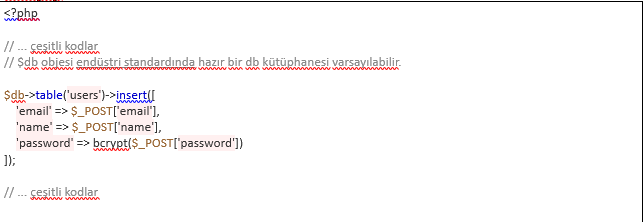

# 💫 Daily-notes
Gün içinde Development yaparken öğrendiğim her şeyi buraya yazmaya karar verdim. Bu şey de olabilir; karşılaştığım hataların çözüm yollarıda olabilir. Ona şimdi emin olamadım.😀
#### O zaman başlayalım 🚀

### 3. Laravel database migration

Laravel de migration dosyaları database/migrations dizininin altında tutulur.

Örnek olarak uçuş bilet bilgilerinin tutulduğu migration için hazırlanmış aşağıdaki class verilebilir.

        <?php
        use Illuminate\Support\Facades\Schema;
        use Illuminate\Database\Schema\Blueprint;
        use Illuminate\Database\Migrations\Migration;

        class CreateFlightsTable extends Migration
        {
        /**
        * Run the migrations.
        *
        * @return void
        */
                public function up()
                {
                        Schema::create('flights', function (Blueprint $table) {
                        $table->bigIncrements('id');
                        $table->string('name');
                        $table->string('airline');
                        $table->timestamps();
                        });
                }

        /**
        * Reverse the migrations.
        *
        * @return void
        */
                public function down()
                {
                        Schema::drop('flights');
                }
        }

Yukarıdaki class'ı database migrate etmek için

                php artisan migrate

komutu kullanılır.

https://laravel.com/docs/5.8/migrations

### Koineks Interview PHP Developer Quiz Form

Bu form PHP programcısının seviyesini ve dikkatini ölçebilmek amacıyla oluşturulmuştur.

Formdaki kod yazmayı gerektiren cevaplarınızı renklendirmeyi tercih ederseniz aşağıdaki adresi kullanabilirsiniz:

NOT: Cevaplarınızda LARAVEL FRAMEWORK’ün sunduğu çözümleri kullanabilirsiniz.

✔️ Soru 1: Bir web sitesinde "arkadaş ekleme" formunda csrf token kullanmaz isek ne gibi bir sonuç ile karşılaşabiliriz?

- Bir formda post işlemini yaptığımızı düşünelim.Eğer bu form'da csrf token işlemi gerçekleştirilmesse web sunucusunun ürettiği token bilgisi ile form da üretilecek olan token bilgisi eşleşmeyeceği için bu talebin gerçek bir kullanıcı tarafından geldiği anlaşılmaz.
- Bu durumda şu senaryo düşünülebilir; Csrf token’ nın kullanılmadığını fark eden kötü niyetli birisi, benim hesabım üzerinden istek sahteciliği yaparak istediği kişileri benim hesabım üzerinden ekleme isteği gönderebilir.

✔️ Soru 2: Klasik bir session sisteminin işleyiş mantığını Cookie-Sunucu ilişkisi üzerinden özetleyiniz.

- www.koineks.com adresine browser ile girdiğimizi düşünelim,
- Browser bu adresi barındıran sunucuya, siteyi getirmesi için bir http-request atar.
- İstek web server’a iletildikten sonra, server bizim için bir verify token oluşturur.
- Bu süreçten sonra client server arasındaki bilgi alışverişi bu verify token ile yapılır.Böylece client’ın herbir işlemi için sunucu tarafından kullanıcı için authentication işlemi istenmez.
- Site içindeki diğer sayfaları ziyaret ederken de  web server’a , Httprequest ile bize verilen bu token gönderilir, Web server da bu token' nın bize ait olmadığını control eder ve bize istediğimiz sayfayı HttpResponse ile döndürür.

✔️ Soru 4: Aşağıdaki koddaki güvenlik ihtimali nedir ?

- getUser($_GET['user_id']); Fonksiyona gelen parametreye güvenilerek direct sql sorgusu üzerinde senatize edilmeden kullanılıyor olması sql injection ataklarını beraberinde getirecektir.

✔️ Soru-5: Aşağıdaki koddaki güvenlik ihtimali nedir ?

- Yukarıda eğer senfoninin table yapısı kullanılmış ise sql injection yoktur ama validation her halükarda yapılması gerekiyor.
- Daha sonra, get id yapilmis burda IDOR vardır yani kötü niyetli bir kullanıcı id kismina başka kullanicilara ait bir id numarasi vererek onlarin profilini de yetkin olmadan çekebilir.
- Daha sonra yine echo ile ekrana basmis ID almıştır burda da reflected XSS vardir.

✔️ Soru-6: Uzantısı ne olursa olsun, sadece JPEG resimleri kabul eden bir PHP scriptinin form görseli hariç kısmının kodunu yazınız. Eğer formu ofisimizde dolduruyorsanız neyi kontrol edeceğinizi belirtmeniz yeterli.
        function resimyukle ($dosya_alani = null, $resim = false) {

$dosya_yolu = 'uploads/'; 

$max_boyut = 1000000; //gelebilecek max dosya boyutu

//Set default file extension whitelist
$istenen_uzantılar = array('jpeg','jpg'); //gelecek resim için kısıtladığım whitelist’im.

$dosya_tip = array('image/jpeg', 'image/jpg'); 

$out = array('error'=>null); //Çıktıyı tutacak dizi

if (!$dosya_alani) {
  $out['error'][] = "Geçersiz dosya alanı!!!";           
} //

if (!$dosya_yolu) {
  $out['error'][] = "Geçersiz dosya yolu!!!";               
}

if (count($out['error'])>0) {
  return $out;
}

//Dosya olduğundan emin olalım
if((!empty($_FILES[$dosya_alani])) && ($_FILES[$dosya_alani]['error'] == 0)) {

$file_info = pathinfo($_FILES[$dosya_alani]['name']);
$isim = $file_info['filename'];                                     
$uzantı = $file_info['extension'];

// Gelen dosyanın uzantısı ile istenen_uzantılar’da olan uzantıları karşılaştır!!! 1 
if (!in_array($uzantı, $ istenen_uzantılar)) {                                                                         
  $out['error'][] = "Geçersiz uzantı.;
}

//Gelen dosya tipi ile dosya_tip ta olan dosya tipini karşılaştır!!! 2
if (!in_array($_FILES[$dosya_alani]["type"], $ dosya_tip)) {
  $out['error'][] = "Geçersiz dosya tipi";
}

//Gelen dosyanın boyutunu et !!! 3
if ($_FILES[$dosya_alani]["size"] > $max_boyut) {
  $out['error'][] = "Yüksek boyutlu resim";
}

if ($resim) {
  if (!getimagesize($_FILES[$dosya_alani]['tmp_name'])) {
    $out['error'][] = "Yüklediğiniz dosya jpeg uzantılı değil!!!";
  }
}

✔️ Soru-7: Aşağıda gösterilen yapıdaki diziyi, sayısal değerine göre nasıl sıralarsınız? Eğer formu ofisimizde dolduruyorsanız pas geçebilirsiniz.

        $a ='{"mazhar":100,"fuat":15,"ozkan":-10}';

        - Küçükten Büyüğe Sıralama;

        <?php
                $a ='{"mazhar":100,"fuat":15,"ozkan":-10}';
                $b = json_decode($a);
                $inta = $b->{'mazhar'};
                $intb = $b->{'fuat'};
                $intc = $b->{'ozkan'};
                $numbers = array($inta,$intb,$intc);
                sort($numbers);
                $array = count($numbers);
                for($x = 0; $x < $array; $x++) {
                echo $numbers[$x];
                echo " ";
                }
        ?>

        Output: -10 15 100 

        - Büyükten Küçüğe Sıralama;

        <?php
                $a ='{"mazhar":100,"fuat":15,"ozkan":-10}';
                $b = json_decode($a);
                $inta = $b->{'mazhar'};
                $intb = $b->{'fuat'};
                $intc = $b->{'ozkan'};
                $numbers = array($inta,$intb,$intc);
                rsort($numbers);
                $array = count($numbers);
                for($x = 0; $x < $array; $x++) {
                echo $numbers[$x];
                echo " ";
                }
        ?>

        Output: 100 15 -10 

